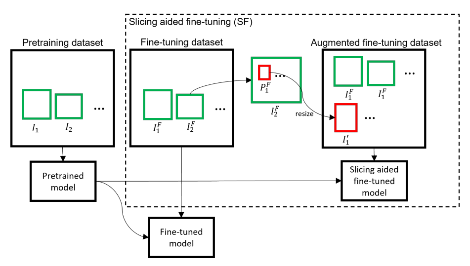
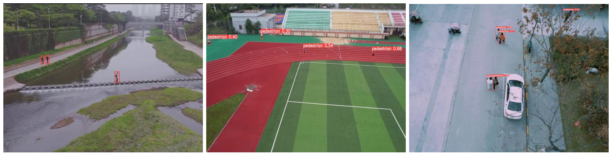

## Slice training method for YOLOv5
This repository is dedicated to the YOLOv5 model for small target detection. Its main objective is to improve the model's accuracy in detecting small objects by training it on sliced images.

  

## Dataset
This repository utilizes the VisDrone dataset (**<https://github.com/VisDrone/VisDrone-Dataset.git>**) for slice preprocessing and trains a YOLOv5 model with the sliced dataset.   

The detection performance of the model is shown in the following images:

  

## How to run

  
**1.** Prepare the dataset according to the format in "EXAMPLE" under the link:   **<https://roboflow.com/formats/yolov5-pytorch-txt?ref=ultralytics>**, and store the dataset images and labels in the **images** and **labels** folders respectively.

**2.** Modify the parameters in slice.py such as **root**, **slice_width**, **slice_height**, **overlap_h_ratio**, **classes**, etc., to suit your needs.

**3.** Run slice.py

## Parameters
**slice_width** and **slice_height:** Represent the size of the slice boxes, overlap ratio is used to avoid the situation where bounding boxes are being devided.  

**overlap_h_ratio** and **overlap_w_ratio:** Move a certain distance back in the original image's height and width directions respectively after each slicing, thereby preserve the training value of the segmented bounding boxes.  

**val:** Used for validating the correctness of the slicing results. When set to True, it will visualize the bounding boxes of the first 'n' sliced images (where 'n' is a specified number).  

**classes:** Target categories contained in the dataset.  

## Get the results
The results of the slicing are saved in the " ../runs/exp" directory.   

The **slice_images** folder is used to store the sliced images.  

The **slice_labels** folder is used to store the sliced labels.  

The **validate** folder contains visualization images of the slicing effects.

